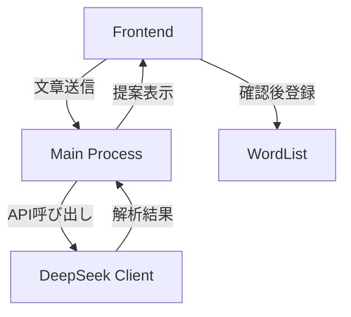

# AI連携機能設計書

## 実装目的
- ユーザーが入力した文章からDeepSeek AIが単語と説明を抽出
- ユーザー確認後に単語を登録する機能を提供

## システム構成


## 主要コンポーネント
1. `DeepSeekClient` (src/common/ai/deepseek.ts)
   - DeepSeek APIとの通信処理
   - レスポンスのパース

2. `AnalysisService` (src/main/services/analysis.ts)
   - 文章解析のビジネスロジック
   - エラーハンドリング

3. [TextAnalysisPanel](../src/renderer/src/components/TextAnalysis.tsx)
   - 文章入力UI
   - 解析結果表示
   - 確認ダイアログ

4. [Appコンポーネント](../src/renderer/src/App.tsx)
   - アプリケーションのルートコンポーネント
   - レイアウト管理
   - ナビゲーション制御

## タスク一覧
- [x] DeepSeekクライアント実装
- [x] 解析サービス作成
- [x] フロントエンドコンポーネント作成
- [x] IPC通信設定
- [x] 単語登録機能連携
- [x] エラーハンドリング実装
- [x] ローディング状態管理

## API仕様
```typescript
interface AnalysisRequest {
  text: string;
}

interface AnalysisResponse {
  words: {
    term: string;
    definition: string;
  }[];
}
